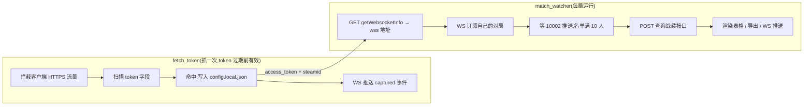

# 开发文档：token 获取与观将台数据链路

本文面向开发者，完整讲解 matchpal 的两条核心数据链路——**token 是怎么抓到的**、
**观将台数据是怎么拿到的**——包括实现选型、协议细节和开发中踩过的坑。
使用层面的说明见 [README](README.md)。

> 所有接口细节均来自对完美世界电竞客户端流量的抓包实测(HAR)，非官方文档。
> 平台改版可能导致本文描述失效。

## 总览



- token 抓取:`fetch_token/src/main.rs`(拦截与扫描)、`ca.rs`(证书)、
  `proxy.rs`(系统代理)、`push.rs`(WS 后端)。
- 数据链路:`match_watcher/src/api.rs`(HTTP 接口)、`ws.rs`(会话)、
  `model.rs`(帧解析)、`session.rs`(事件会话)、`render.rs` / `export.rs`。

## 一、token 获取(fetch_token)

### 1.1 为什么需要中间人代理

access_token 只存在于完美世界客户端与自家服务器的 HTTPS 交互中(URL 查询串、
请求头、Cookie、请求体、JSON 响应都见过)。本地没有 token 存储，唯一可靠的
获取方式是在本机做一次 HTTPS 中间人：客户端 → 本地代理 → 服务器，代理把
过路流量解密、扫描 token 字段、再原样转发。

### 1.2 执行流程(`fetch_token/src/main.rs`)

1. **自动提权**：`ShellExecuteW runas` 弹 UAC(改系统代理、装机器库证书都要管理员)。
2. **现场生成 CA**(`ca.rs`):rcgen 每次运行生成一把仅存在于本机内存/磁盘的 CA，
   私钥绝不分发；证书名 `WMPVP Token Sniffer CA`。
3. **安装 CA**:`certutil` 装入机器库(默认)或用户库(`--ca-store user`)。
4. **设系统代理**(`proxy.rs`):写注册表 `ProxyEnable/ProxyServer` +
   `InternetSetOptionW` 通知生效；退出时还原原值。
5. **hudsucker 拦截**：扫描过路流量的 URL、请求头、Cookie、请求体、JSON 响应体。
6. **命中**：组装配置 JSON → 写 `config.local.json` → 同一份 JSON 经 WS 后端
   (`push.rs`,默认 `ws://127.0.0.1:8787`)广播给客户端 → 清理代理与证书。

上游 TLS 用 `with_native_tls_connector()`(Windows 上是 schannel，读
**Windows 证书库**)——本机装了中间人 CA 时只有走系统证书库才连得上；
换成 rustls 默认根证书会报 `invalid peer certificate: UnknownIssuer`。
这是选型的决定性原因。

### 1.3 token 识别规则

**字段名匹配(`name_matches`)**:

- 强名(`access_token`、`steam_cn_token`、`accesstoken`、`pvp_app_token`)
  允许后缀匹配(如 `user_access_token` 命中)；
- 泛化短名(如 `token`)只允许**精确匹配**——它一旦参与后缀匹配，
  `userauthtoken` / `csrftoken` / `xsrf_token` 全都撞进来。

**取值过滤(`plausible`)**:非空、长度 ≤ 2048；非强名要求长度 ≥ 24 且字符集
为字母数字加 `._-`——弱名容易撞上 CSRF / 一次性 token，用长度和字符集兜一道。

**伴随字段(`companion_steamid`)**:`steamid` / `loginSteamId` / `pwasteamid` /
`uid` 只在"17 位纯数字"时才认——任何接口的订单号都可能长这样，放进来会污染
跨请求共享的 extras，把错的账号 ID 写进配置。

**域名白名单(`host_matches`)**:默认只放行完美世界 / Steam 系域名
(`args_handler.rs::default_hosts`)。空主机名放行(宁可多扫不漏抓)；
比较必须带 `.` 边界——否则 `evilwanmei.com` 会被 `wanmei.com` 放行。
白名单既是防误收的闸也是降噪的闸:`assets.msn.cn`(Windows 资讯流)会送来
一个叫 `userauthtoken` 的 JWT，落盘后还会被别名逻辑写成 `access_token`，
下游拿着它请求必然失败。

实测的 token 命中域名:

| 域名 | 角色 |
| --- | --- |
| `pwaweblogin.wmpvp.com` | 下发 / 携带 `steam_cn_token` |
| `appactivity.wmpvp.com` | 对战接口(getWebsocketInfo 等) |
| `gwapi.pwesports.cn` | token 直接挂在 URL 查询串上 |
| `wss-csgo-pwa.wmpvp.com` | 对局 WebSocket 握手 |

### 1.4 请求体的可读性规则

Python 版实测发现 POST `/user-info` 的 **body 里带着 access_token**——只扫
URL / 头 / Cookie 会漏掉这一路。但读 body 是有代价的操作，规则如下
(`main.rs::body_is_readable`):

- 只读会带 body 的方法(POST / PUT / PATCH);
- 只读文本类 Content-Type(JSON / 表单)；
- **必须自带 Content-Length 且 ≤ 512KB**——没有长度的是 chunked / 流式：
  读 chunked 请求会让 body 变成定长，与原有的 `Transfer-Encoding` 头对不上；
  流式响应(SSE、长轮询)会把连接挂死；
- HTTP 101(协议切换)之后的 body 是隧道，绝对不碰——客户端连
  `wss-csgo-pwa.wmpvp.com` 就靠 WebSocket 升级请求，动了 body 握手就废了。

读出的 body **原样重建**后放行(hudsucker 的 Body 可从 Bytes 还原)，
收集失败则用空 body 兜底放行，宁可丢数据不可断流量。

### 1.5 配置文件与 WS 推送

命中的字段组装进 `config.local.json`(access_token / steamid / captured_at /
source_url / uid 等)，别名逻辑保证下游永远能按 `access_token` 取到值。
`write_config` 返回落盘的 JSON 文本，同一份经 WS 后端广播——落盘与推送
永远一致。协议与接入示例见 README 的「作为后端使用」。

## 二、观将台数据链路(match_watcher)

### 2.1 getWebsocketInfo:拿对局推送地址

```text
GET https://appactivity.wmpvp.com/steamcn/match/watchStage/getWebsocketInfo
    ?steamId=<本机账号>&platform=2
请求头: accessToken / pwasteamid / device / appversion / platform=h5_pc /
        appTheme / X-Requested-With / Origin / Referer(见 api.rs::headers)
响应:   {"code":1,"message":"success",
         "result":{"websocketUrl":"wss://wss-csgo-pwa.wmpvp.com"}}
```

- 所有请求头是从抓包里照抄的，顺序不重要、内容要对。
- **这个接口不校验 token**:实测拿垃圾 token 甚至 `steamid=123` 也返回
  `code=1` 和合法 ws 地址。所以 `--check` 通了不代表 token 有效。

### 2.2 对局 WebSocket:订阅与推送

```text
握手  wss://wss-csgo-pwa.wmpvp.com
      Cookie: PVP_APP_TOKEN=<token>     ← 鉴权全靠握手 Cookie，帧本身无凭据
      Origin: https://news.wmpvp.com
发    {"messageType":10001,"messageData":{"steam_id":"<本机账号>"}}   ← 订阅
收    {"messageType":10002,"messageData":{ ...对局数据... }}          ← 推送
```

实现要点(`ws.rs` / `model.rs`):

- **连上先发应用层文本 `ping` 再发订阅帧**，顺序是实测的；20 秒一次心跳。
- **读帧超时 1 秒自己设**:Python 版踩过的坑——握手后 socket 会被重置成
  阻塞模式，不设超时 `recv()` 永远挂着，外层 `--timeout` 根本检查不到。
  这里 `read_frame()` 返回 `Ok(None)` 表示"这一秒没数据"(含 Pong / 二进制帧)，
  与"连接断了"严格区分;Windows 上超时是 `TimedOut`(10060)，别只判 `WouldBlock`。
- **15 秒没收到对局数据就重新订阅一次**(`--resubscribe`)。
- 断线重连:`--retries` 次上限，间隔 3 秒。

### 2.3 推送帧(messageType 10002)

`messageData` 里的关键字段(`model.rs::MatchInfo`):

| 字段 | 说明 |
| --- | --- |
| `matchId` / `map` / `type` / `startTime` | 对局标识与元信息 |
| `ctScore` / `terroristScore` / `aveScore` | 实时比分 |
| `playerList[]` | `steamId` / `side`(CT / TERRORIST) / kill / death / assist / adr / headshot / score / alive |

注意:

- 推送帧**没有昵称**——昵称只在战绩接口的返回里；
- `side` 的取值随推送可能变化，识别不了的玩家进 `teams.unknown`，
  渲染时会警告且不计入表格。

### 2.4 战绩接口:getPvPMatchTeamStatisticsData

```text
POST https://appactivity.wmpvp.com/steamcn/match/watchStage/getPvPMatchTeamStatisticsData
请求头: 同上
请求体: {"ctTeamSteamIds":["..."],"teTeamSteamIds":["..."],"map":"de_dust2"}
响应:   {"code":1,"result":{
          "ctPlayerStatsDTOList":[ {玩家} ... ],
          "tplayerStatsDTOList":[ {玩家} ... ],   ← 注意 t 前缀的拼写
          "ctTeamDTO":{...},"tteamDTO":{...}}}
```

单个玩家的字段(`model.rs::PlayerStat`):`steamId`、`nickname`、`kd`、
`ratingPro`、`adr`、`we`、`map`、`mapWinRate`、`ctWinRate`、`win/lose/draw`、
`pvpScore`、`snipeRate`、`headShotRate`、`flashSuccessRate`、`anonymous`、
`twinRate`。队伍汇总(`ctTeamDTO`)里还带各单项"最高者"的 `first`/`second`
键值对(`first` 是 steamid，`second` 是值字符串)。

- `t` 队伍名单有 `tplayerStatsDTOList` / `tePlayerStatsDTOList` 两种拼写，
  解析时做了兼容；
- 战绩查询失败不中断——名单本身仍有价值，表格退回按 SteamID 的实时数据。

### 2.5 事件会话与消费端

`session.rs::run_session` 是 CLI 与 WS 后端共用的编排层：循环里发生的每件事
都发成 `WatcherEvent`(Account / Connected / Progress / Resubscribed /
Notice / Raw / Report / Finished)，CLI 把它映射回日志文案，WS 后端
(`push.rs`,默认 `ws://127.0.0.1:8788`)把它序列化成 JSON 广播。新增消费端
(GUI、脚本)只需要实现一个 `FnMut(WatcherEvent)`。

`Raw` 事件带两路未加工数据:`push_frame`(10002 完整信封)与
`stats_response`(战绩接口原始响应，`StatsReport::raw_response` 保留)——
排查协议问题时对着它看，不用重新抓包。

### 2.6 测试样本

`match_watcher/src/testdata/stats_response.json` 是一份 10 人齐全的真实形状
战绩响应(steamId / 昵称已随机化，数值保留)，覆盖解析与渲染链路的单元测试，
也可直接 `--replay` 或经桌面演示按钮走生产渲染路径。

## 三、坑清单(开发前必读)

| 坑 | 结论 |
| --- | --- |
| 只扫 URL / 头会漏 token | token 在 POST body 里也出现过，body 读取规则见 1.4 |
| MSN 资讯流的 `userauthtoken` 污染 | 白名单 + 泛化名精确匹配，两道闸缺一不可 |
| rustls 连不上上游 | 上游 TLS 必须走 schannel(读 Windows 证书库)，见 1.2 |
| WebSocket 升级请求不能动 body | 动了握手就废；101 之后是隧道，不碰 |
| chunked / 无长度 body 不能读 | 读完与 `Transfer-Encoding` 头对不上 |
| 握手后 socket 变回阻塞模式 | 读超时要自己设，否则外层 timeout 失效 |
| Windows 读超时是 `TimedOut` | 判定要同时接受 `WouldBlock` 和 `TimedOut` |
| `getWebsocketInfo` 不校验 token | `--check` 通 ≠ token 有效 |
| `tePlayerStatsDTOList` 拼写 | t 队名单有两种拼写，都要兼容 |
| side 取值会变 | 阵营识别失败的玩家单独列出并警告 |
