# CSGO完美平台开局数据助手开发: 数据获取

> 免责声明
>
> 本文所有内容仅供技术学习与交流，请勿用于任何商业或非法用途。
>
> 文中的抓包与分析均基于作者本人的账号和本人设备上的流量完成，不涉及、不存储任何第三方用户的数据；文中提及的平台名称、商标及接口均归其权利方所有，本文内容与官方无任何关联，亦不代表官方立场。
>
>逆向分析的结论基于写作时的实测，平台协议随时可能变更，本文不构成任何长期有效的技术承诺。第三方工具与平台服务条款之间可能存在冲突，读者若参照本文进行任何操作，请自行了解并承担相应风险。
>
>如本文涉及您的权益，请联系作者删除。

## 前言

那几天在完美打csgo的时候，无聊喜欢看看队友和对手的成分，~~当然我自己就是个瘤子~~，当然想看看这把有没有大哥，对面强不强。

当然看队友成分就很简单，在没有加载进入到游戏时，完美平台就会显示队友，点击队友的头像就能进入查看队友的数据，而对手的是隐藏的，当然，如果我们在手机上看完美app时，查看观将台，还是可以看到对手的数据的。

但是，**好麻烦**

还要一个一个点，手机也要点。

作为一个学计算机的懒人，为什么我不自己写一个程序，自动化一点呢？

## 信息检索

当然，懒人有懒人的做法，别人有现成的是最好的，但是在使用浏览器进行检索的时候，只发现了这个项目: https://github.com/Redamancy520/PerfectWorld-API-Collection

但是这个项目只收录了很少的api，而且也是很久没有更新了。

那没办法了，只能自己手操了。

## 工具

本次使用的工具:

- 小黄鸟(reqable): 网络代理抓包工具
- deepseek, zcode

## 过程

在最开始的时候，我在想，能不能试试直接把登陆的完整流程复现出来，之后再来获取数据，当然这绝对很麻烦，完美也不是什么小平台了。

### 参数分析

使用小黄鸟进行登陆时的抓包

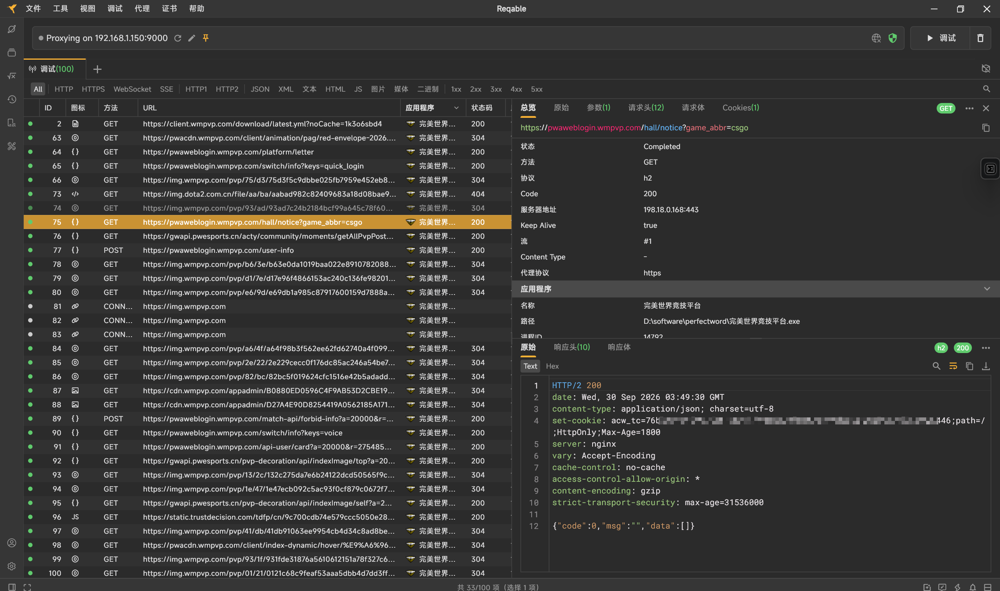

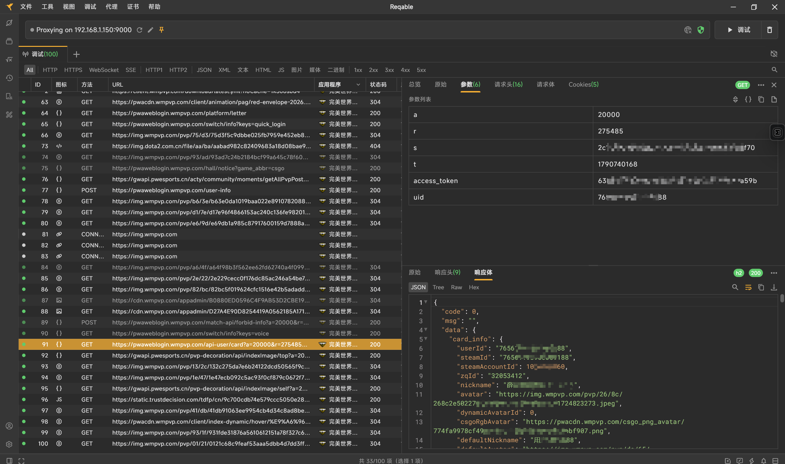

在第二张图片中，我们可以看到，登陆后可以获取到的部分数据，包括用户id，steamid，steam_cn_token，用户名等信息。

but，但是

在上方的请求参数中，他需要`s`, `accesstoken`, `uid`，这个时候，我们顺便看看其他的API请求所需要的参数

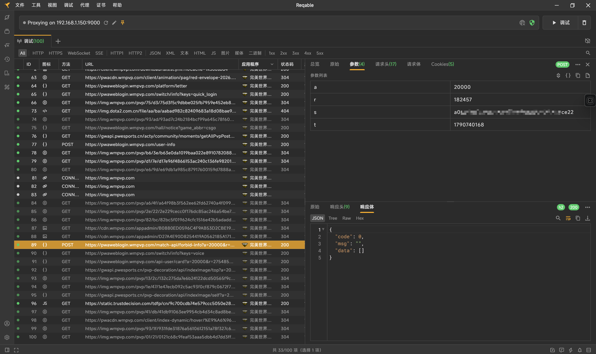

看的出来后面要请求其他的API，也需要这几个参数(后面的个人数据部分并不需要)。

在请求的参数中，如果多查看几个抓包数据就可以分析出，`accesstoken`就是`steam_cn_token`，`steamid`就是`uid`(注意：这是本文涉及接口的情况；后面会遇到搜索接口，它返回的 `userId` 是另一套短数字 ID，和 steamid 不是一个东西，别混用)，其中的`s`是使用加密随机生成的。

所以，如果说，就算是我们通过了正常的登陆，获取到了`accesstoken`或者`steam_cn_token`，但是`s`这一关我们也会处理的很麻烦。

但是我们的目标是什么？

我们不是要把完美的各个api扒下来，我们只需要一个对局前查看信息的东西，作为懒人，能不能最懒的拿到这些数据？

## 转折：不逆登录，逆入口

### 数据界面抓包

所以我们点击完美的个人数据界面，就会有这个包

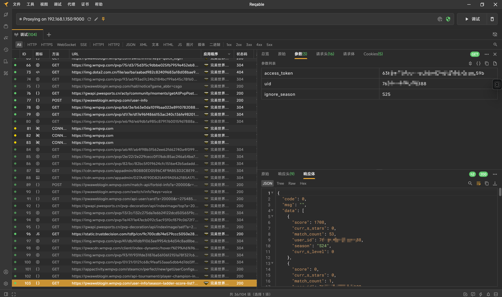

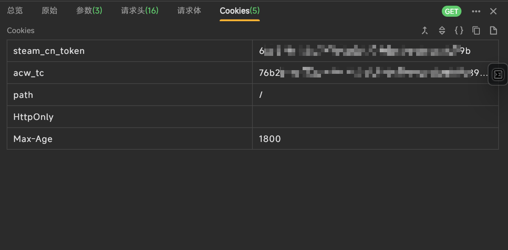

这是个人数据界面的包，但是这个请求中，没有`s`，只需要自己的`uid`和`steam_cn_token`就可以。

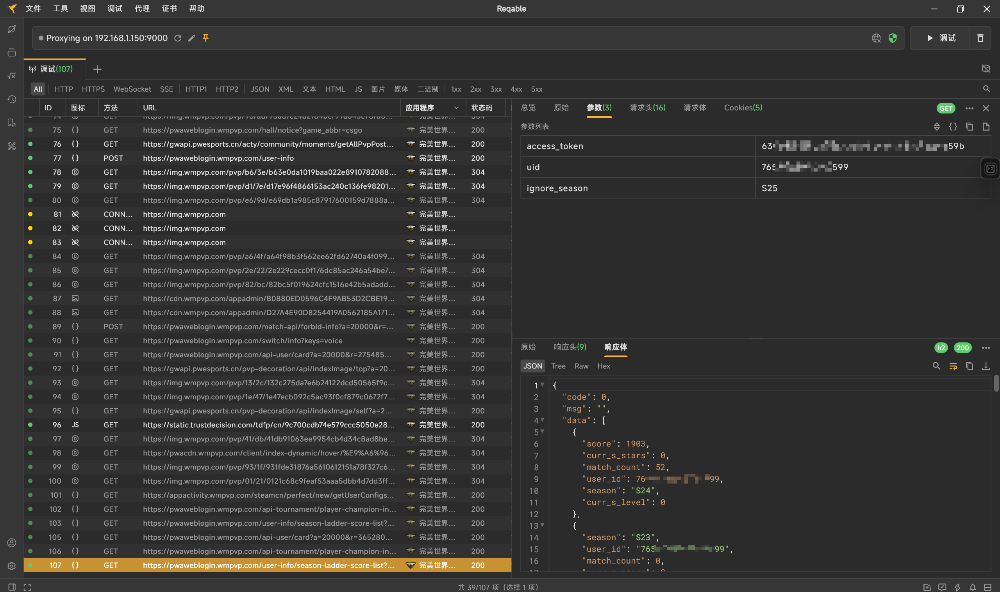

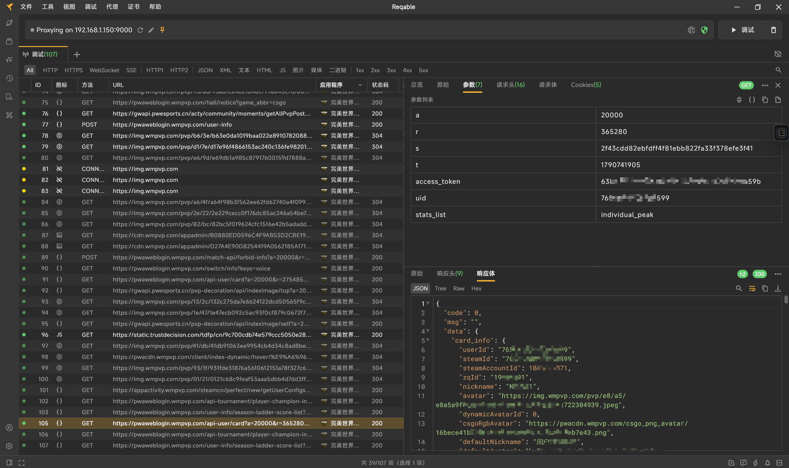

而在这两个抓包中，是我点击了我好友的个人界面。

这里可以发现，个人资料卡方面的api都是需要经过`s`等参数的加密才能获取的，但是作为我们懒人，只需要看个历史最高得分也是足够了，所以在这里的第一张的图片中，我们**发现**和上面我们查看自己的历史赛季得分中，只有`uid`的不同，`uid`换成了对应的玩家的`uid`，而`accesstoken`始终是自己的。

而在点击个人数据界面不会有新的数据，说明，数据都在刚才的需要`s`才能获取的api中返回，而点击比赛记录所抓包获取的内容，也是需要`s`才能获取，还有变量`r`。

既然这些都这么麻烦我们也就不弄了，看个历史最高记录得了。

### 队友对手数据获取

但是，我们现在只看了一些无关痛痒的东西，那么对局开始时的队友和对手的信息怎么看？我要怎么知道他们的uid？

我并没有在对局开始时进行，抓包，因为我之前用过完美app的观将台的功能，所以我就在想，要不要看看观将台能不能把数据拿出来。

在手机上安装上小黄鸟，用电脑进行连接，并打开完美app的观将台。

看别人对战的数据分析和自己的对战数据分析，过程是一样的。

这是我当时保存的在加载进入游戏到观将台开始显示数据的抓包信息

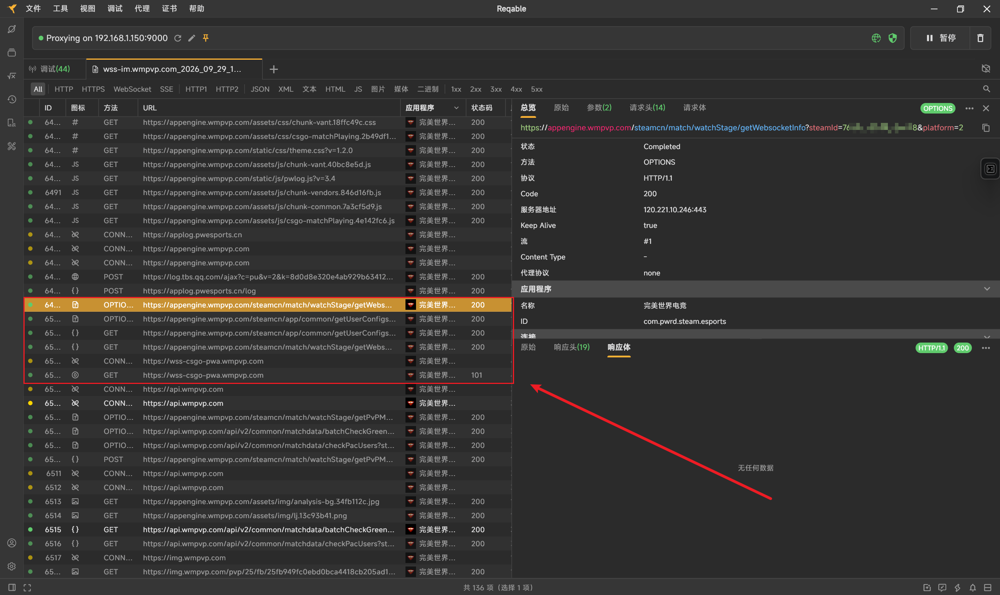

在这里面重要的就这几个包

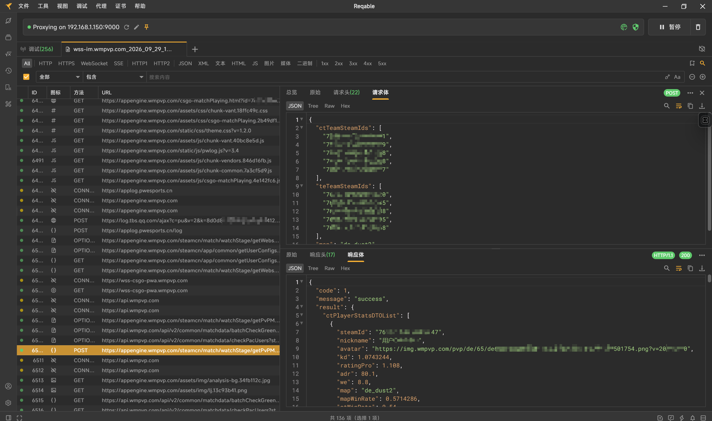

我们可以看到在这个api中，这里返回了对局中的信息，包括队友对手的kd, rt, we等信息，所以我们在这里进行获取对局信息就可以。

但是如果我们仔细审查这个api请求就会发现，不是，你uid哪里来的？队友对手的api搁哪给我发过来的？

在观将台里面，队友对手的uid的信息，并不是通过json数据返回出来的，而是在websocket中，进行推送的。

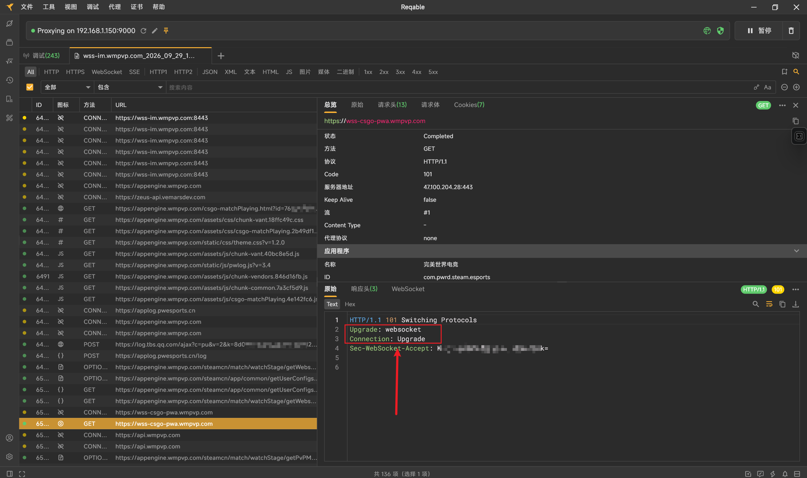

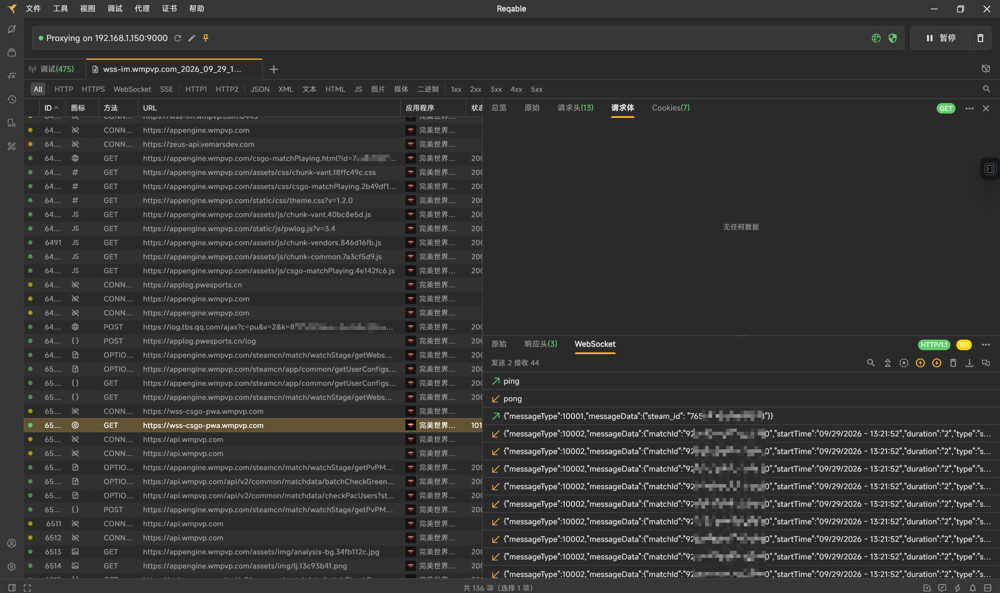

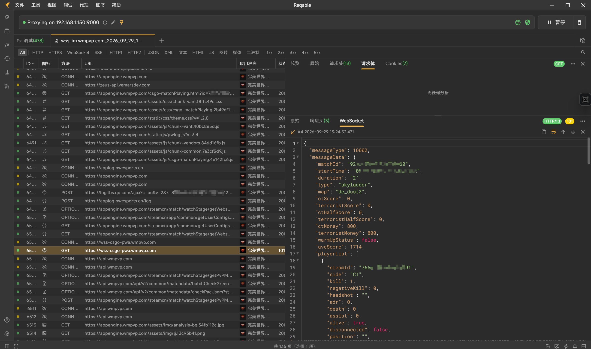

ws会推送对局情况。

这样的话，我们就可以在人满，ws服务端推送时，将所有人的uid记录下来，然后使用上面我们找到的对局api中进行使用。

**所以：队友对手的uid，是服务端在 WebSocket 里主动推过来的。**

### 分析所需操作

所以捋一下思路。

我们要看对局的队友和对手的数据信息。

数据信息所依赖的api：POST /steamcn/match/watchStage/getPvPMatchTeamStatisticsData

请求体的信息依赖队友，对手的uid，以及地图信息

这里所依赖的信息，最终都会由ws服务端进行推送，也就是上方图片中的ws推送信息。

而ws推送的链接又依赖

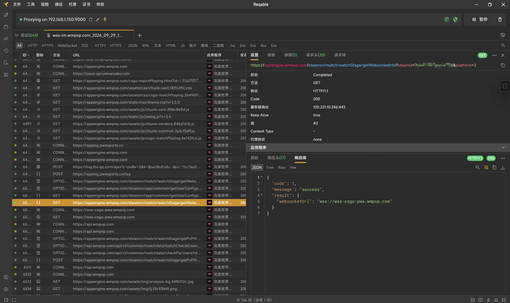

这里所返回的信息，而调用这个接口需要自己的uid，鉴权走**请求头 accessToken**（实测这个域的接口不需要 Cookie；之后会遇到 `pwaweblogin.wmpvp.com` 域的接口，那个靠的是 Cookie 里的 `steam_cn_token`——两个域两种姿势，别搞混）。

最终顺序应该是:

1. 获取accesstoken和uid
2. 使用 GET /steamcn/match/watchStage/getWebsocketInfo?steamId=765***********88&platform=2获取进行连接的ws链接
3. 自己实现一个 WebSocket 客户端，按同样的协议接入，获取对局信息
4. 使用POST /steamcn/match/watchStage/getPvPMatchTeamStatisticsData 获取对局信息

### 验证：用 curl 手工走一遍

四步捋顺之后，先别急着写程序，用 curl 手工重放一遍，把变量一个个隔离。以历史赛季得分接口为例，实测有两个坑：

- 只把 token 放在 query 参数里会报 `1033`——这个域的鉴权在 **Cookie `steam_cn_token`** 里；
- `ignore_season` 必须填**当前的赛季**（比如 S25），填别的赛季、留空或不带都会报同样的错。

调不通接口的时候，别急着怀疑人生，像这样一次只动一个变量，答案自己会浮出来。

## 实现思路

这里仅简单讲解思路，不贴具体代码。前面说过，复现登录要逆 `s` 参数，投入产出比太低。换个角度想：我不需要“生成”凭据，我只需要“拿到”凭据——凭据是我自己登录时产生的，让它流经我看得见的地方就行。

所以，在本地起一个代理，让所有流量经过它，从请求的 URI 中把 accesstoken 和 uid 提取出来(多看几个 URI 就会发现这些信息是直接明文放置的)，这样省去了逆向过程，只需要在完美的界面点几下就可以获取到。

之后，可以通过这个 accesstoken 和 uid 去获取 ws 的链接。

再就是自己实现一个 WebSocket 客户端接入——服务器会向每个订阅连接各推一份数据，所以我们接入后，数据会照常往这边推。拿到名单后，直接使用 POST /steamcn/match/watchStage/getPvPMatchTeamStatisticsData 获取开局时的对局数据就可以了。

